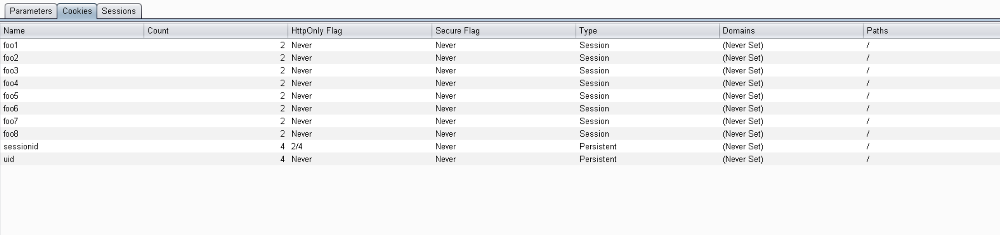

# Cookie Analysis

The cookie analysis tab provides a table of cookies found in the proxy history.  This table can be used to quickly determine
which cookies where set with unsecure settings.  The following screenshot is an example:

[View Full Size](screenshots/04-cookies.png)

This table contains the following fields:

* **Name**: The name of the cookie
* **Count**: A count of the number of times the cookie was set.
* **HttpOnly Flag**: Indicator of how frequently the HttpOnly flag was set for this cookie.
* **Secure Flag**: Indicator of how frequently the Secure flag was set for this cookie.
* **Type**: Is this a Session cookie or a Persistent cookie?  Persistent cookies have an expiration or max-age value set, and will be saved to disk. Session cookies only stay in memory until the browser is closed.
* **Domains**: A list of domains for which this cookie was set. Look for cases where a cookie is overly-scoped such that it works across all subdomains.
* **Paths**: A list of paths for which this cookie was set.

## Exporting
There is a `Save` button at the bottom of the tab that can be used to export this entire table as a csv file.