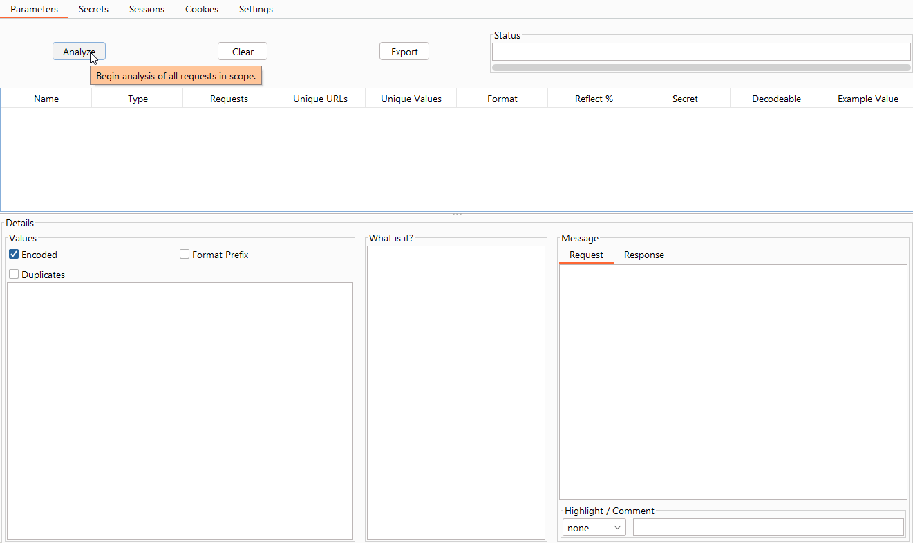
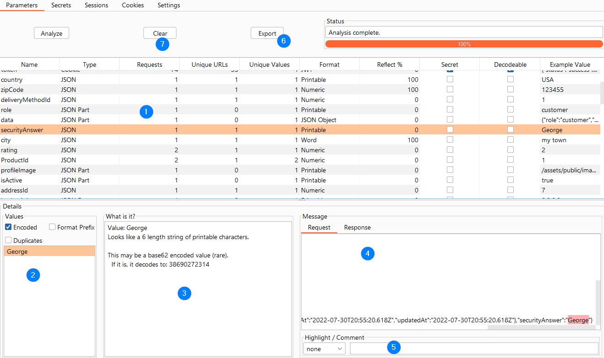

# Parameter Analysis

## Usage

*IMPORTANT: Set your Scope on the Target-->Scope tab. Paramalyzer only analyzes URLs that are set as in-scope.*

Once you have mapped out your application you can go to the Paramalyzer tab and proceed.  If you have items that you know
should be ignored from this analysis, then make sure they are listed in the `Ignore These` box. VIEWSTATE parameters are
listed there for you by default.

*IMPORTANT: Paramalyzer examines your proxy history to understand the application's parameters. It will get confused by attack payloads in the proxy history, so it is best to run Paramalyzer after mapping the app but before you start injecting attack payloads.*

Then press the Analyze button as seen in the image below: 

[View Full Size](screenshots/02-analyzer-parameters-v2-2-1.png)

Analysis may take several seconds when covering a long proxy history.  Paramalyzer will make its best effort to identify 
each request parameter present, including:

* URL (i.e. classic ?key1=value1&key2=value2)
* Cookies
* Classic POST body parameters
* JSON
* XML

The specific rules used to find parameters are determined by Burp Suite.

Once the analysis is complete, the screen should look something like the following example:

 
[View Full Size](screenshots/03-analyzer-parameters-v2-2-1.png) 

## Workflow

The usual workflow, using the above screenshot as a reference, is as follows:

### 1 - Main Table
The fields in this table are as follows:

* **Name**: The name of the parameter.
* **Type**: The type of parameter.
* **Requests**: A count of the number of analyzed requests containing this parameter (includes duplicates).
* **Unique URLs**: A count of the number of different URLs containing this parameter.  Useful for finding parameters that are passed around a lot vs. just used sparingly.
* **Unique Values**: A count of the number of unique values for the given parameter.  Useful for finding parameters that never change or that change frequently.
* **Format**: Paramalyzer makes its best effort to determine the real format of the parameter. This includes recursive decoding as needed. See [Supported Formats](#supported-formats) for a list of analyzed formats.
* **Reflect %**: What percentage of the parameters were found reflected in the response?  This is helpful for finding potential XSS candidates.
* **Secret**: This editable field designates this parameter as a secret. Paramalyzer will attempt to guess some of these for you. More on secrets later. 
* **Decodable**: If the parameter value appears to be encoded in a recognized format (e.g. URL-encoded, base64-encoded)
* **Example Value**: Display an example value for this parameter. By default this will show the decoded version of the value if it is encoded.

Look through the table for interesting values.  This will depend on the application but the types of things you are looking for will include:

* Parameters that get consistently reflected could potentially be used for XSS or HTML-injection.
* Parameters containing secrets, like sessions or user information could be exposed.
* Hashes may have originated with interesting or sensitive information.
* Consider which parameters are used to control business logic / flow

### 2 - Values List
When you click on a parameter in the main table, its list of unique values is displayed in the bottom-left corner.
By right-clicking any value in the list you will see the following context menu:

* **Copy List to Clipboard**: Sometimes useful when you need to pull a list for a report or as input into another tool such as *Intruder*.

### 3 - What is it?
When you select an item from the Values List, Paramalyzer will explain how it derived the Format of the value. In the example 
screenshot it is telling us that it found this value to be 40 hexadecimal characters, which is consistent with a SHA-1 value.
If Paramalyzer was able to decode the value, then each decoding step will be explained here as well.

### 4 - Req / Resp
The request and response containing the selected value will be available here.  The value will by highlighted in pink. 
By right-clicking anywhere in the request box you will have the option to send it directly to *Repeater*. 

### 5 - Highlight / Comment
You can select a highlight color and add a comment below the message box. These settings affect this message in the proxy 
history tab, which can help you find the request or response later.

### 6 - Export
The parameter table may be exported to a parsable format (semicolon-delimited).

### 7 - Clear
In the event that you add more information to the proxy history or change your application scope, you can use the _Clear_ 
button to reset Paramalyzer and make it ready to _Analyze_ again.  

## Supported Formats
Paramalyzer can recognize several different formats of data, as follows:

* Numeric
* Text
* MD5
* SHA-1
* SHA-224
* SHA-256
* SHA-512
* Base64 Encoded
* URL Encoded
* Big IP Format
* Hex String
* Email Address
* SSN
* Credit Card
* HTML Fragment
* JSON Object
* PHP Serialized String
* Base 62 Encoded Text