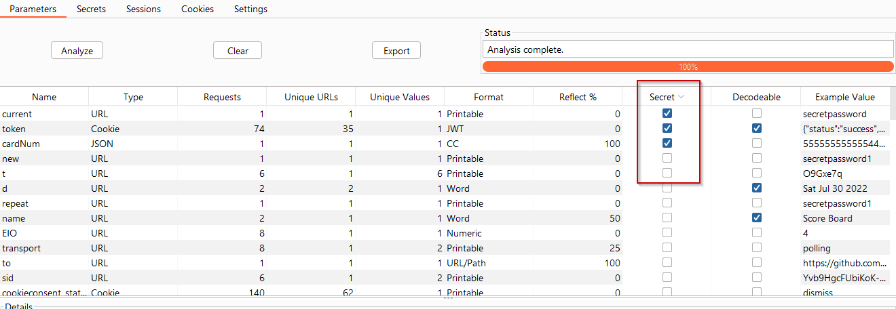
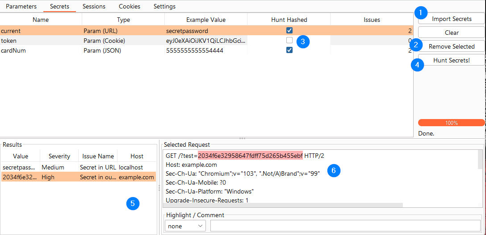

# Secrets Hunter

The purpose of this tool is to leverage the data that has already been collected by paramalyzer to search for the exposure 
of secrets. In this context, a secret is any type of information that is intended to be kept within the scope of the application 
(i.e. between the application and the user). Secrets Hunter looks for the following types of exposure:

* A secret value is found in a url
* A secret value is found in any out-of-scope request

This tool relies heavily on the target scope setting in Burp Suite.

## Usage

On the main parameter table you may have noticed the _Secret_ column. 

[View Full Size](screenshots/09-secrets-parameters-tab-v2-2-1.png)

Paramalyzer will try to guess secrets for you, but this process works best if you curate that list (the _Secret_ checkboxes are editable). 
Go through your parameters and check the box for any parameters that you would not want leaked to a third party. Uncheck 
the box for parameters that don't matter, such as those that only have blank values or perhaps show an index number rather 
than a sensitive value.

Next, take a look at the secrets tab:

[View Full Size](screenshots/09-secrets-secrethunter-tab-v2-2-1.png)

You can follow the numbers in the screenshot to see the general workflow for this tab is as follows:

1. Press the _Import Secrets_ button. This will bring all the secrets over that you selected on the Parameters tab. If you missed some, simply press _Clear_, fix your list in the Parameters tab, and hit this _Import Secrets_ button again.
2. You can further curate your list by removing anything that doesn't belong here. Searching for secrets can take a while when you have a lot of proxy history, so it is best that this list only be as long as necessary.
3. Check boxes for _Hunt Hashed_ for items that you might expect to be hashed (passwords is an example). This makes the search take longer, as it will search for MD5, SHA1, and SHA256 versions (upper and lowercase) of each secret value.
4. Press the _Hunt Secrets!_ button, and wait for the search to complete.
5. For any secret that lists an issue count more than zero, select it and review the results list.
6. You can select any item on the results list to see where the value was found in the request.

## Limitations
* Currently, Secrets Hunter will only search for the first 20 unique values for any given parameter.