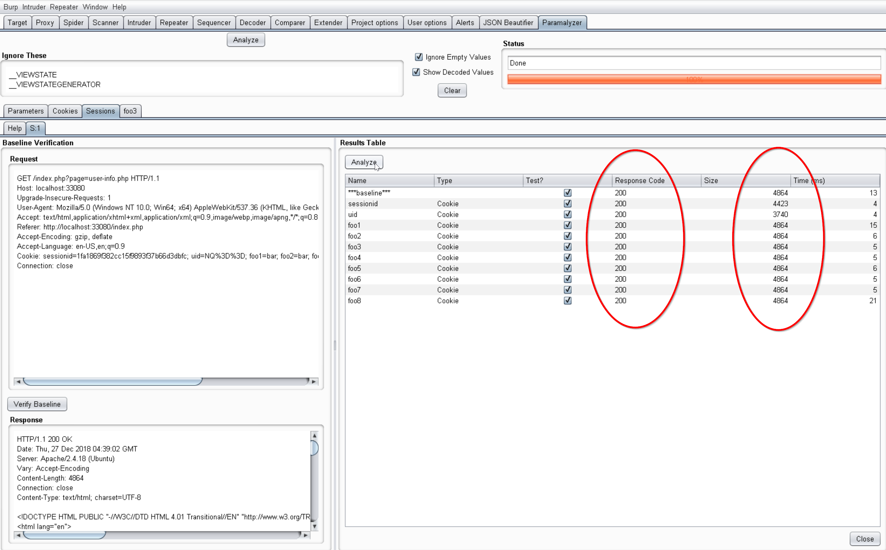

# Session Analysis

The Session Analysis functionality of Paramalyzer will, provided a baseline request, issue a series of test case requests
such that one cookie will be omitted from each test case. The goal is to determine which cookies influence the session state.
This can be particularly helpful in complex application state scenarios.

## Send to Paramalyzer

To begin, find a request / response pair that already contains all the cookies to be analyzed, which normally means one where
a user has already been authenticated.  When your right-click, you should see a `Send to Paramalyzer` option in the context
menu as follows:

Clicking this option will create a new sub-tab under the Paramalyzer Sessions tab.

## Session Analysis Tab
When the tab is first open you will see the baseline request displayed along the left and a table on the right. At this point
it is wise double-check that your baseline request is still valid and producing the proper authenticated response. Session
analysis won't work with invalid session cookies.  Once you are satisfied that the request is still valid, hit that `Analyze`
button.  The table should populate as seen in the following screenshot:

[View Full Size](screenshots/06-session-analysis.png)

By reviewing the response codes and returned sizes and comparing them to the baseline, you will often be able to determine
which cookies are essential to the application state.

*Note: If the request has a `Authorization` header, a test case will be added for this as well. 

By right-clicking any of the items in this table you will be presented with one or more of the following options:

* **Send to Repeater**: Sends the request to repeater for further testing.
* **Send response to Comparer**: Sends the response to comparer.  Useful when you want to see what specifically changed
between the baseline and a test case.
* **Find Origin Response**: Searches through Burp's proxy history for the first occurrence where the specified cookie was
set to the value in the baseline request.

## Find Origin Response
If the origin response is found, it will pop-up in a new dialog window as seen below:

This window will include both the request and response, and will will function like any other request/response editor inside
of Burp, which means right-clicking on these items will provide options to send them to other Burp tools.